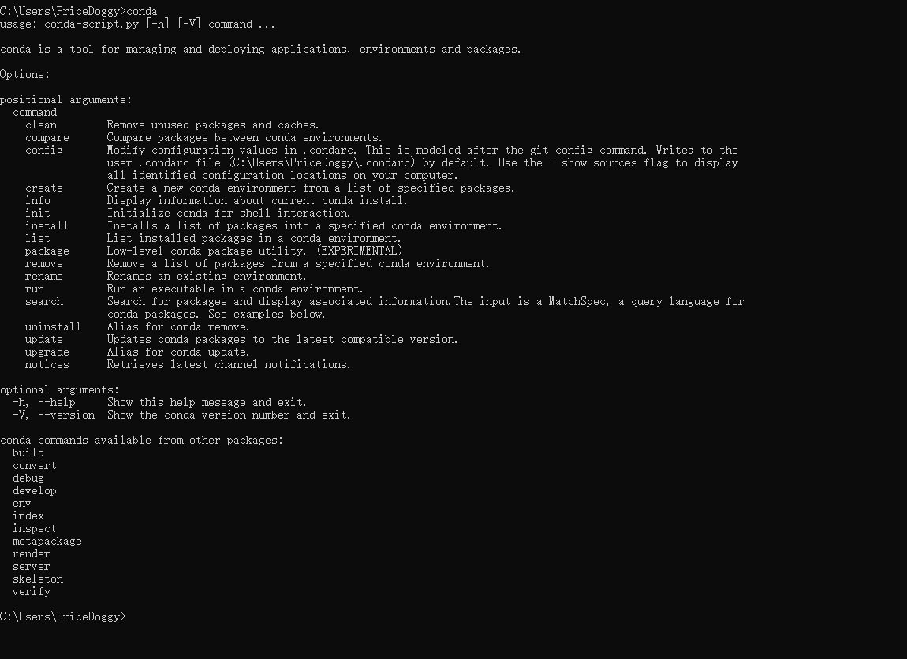

# Aixingpai_Tool
为艾兴拍软件定制的用户行为模拟脚本

### 使用步骤：
1. 打开MuMu模拟器，找到艾兴拍APP并点击打开
2. 将艾兴拍界面拖拽到任意位置保证所有按钮都显示出来且脚本运行期间不要遮挡APP界面
3. 打开shop_list.txt，写上要操作的商品，格式为{商品名} {操作时间}，可参考样例
4. 双击【启动脚本.bat】启动脚本，脚本运行期间，不要遮挡APP界面

### 程序更新
执行update.bat更新程序

### 环境安装
1. 必要软件：
    MuMu安卓模拟器、Anaconda、艾兴拍apk安装包
    - anaconda:https://www.anaconda.com/download/success
    
   一路下一步就可以了，安装完成后，输入win+R，弹出搜索框，输入cmd打开终端，输入conda，查看是否有打印，如果有以下输出，则安装完成
   
    - MuMu安卓模拟器和艾兴拍安装包:
   艾兴拍安装包目前为v1.1.28.apk，后续有更新就用新的apk包
   下载完成MuMu模拟器之后，把apk拖进去就下载完成了
   
2. 下载完上述软件后，点击win，输入powershell

在运行栏里进入艾兴拍的项目目录，执行【安装.bat】，保证网络畅通，有时候网络不好需要多执行几次
